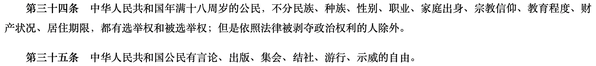

# ***** ANYONE READING THIS, PLEASE DO NOT SPREAD IT OUT FOR NOW. CURRENTLY ONLY THE USE OF ASSIGNMENT *****
## Assignment 1 Cross Platform
#### Student Name: Peng Wang (Edward)
#### ID: 041094691
----
### Instructions:
You just need to keep my original way of storing these files and folders. The
only file you need to run at your localhost is named "index.html", run this in your preference, and you should see everything is working.<br>If you have trouble viewing my assignment properly, please contact my student email thanks (wang0934@algonquinlive.com)
(>>> Please Rate Me A Nice Mark Professor! I Do Try My Best To Keep My Hands on It for Weeks!! Thank you for reading and marking. <<<)
----

<br><br>
#### Real Talk:
# Everyone deserves human rights, including my peoples back in China.

```markdown
... But you are not at all like us. 

With everything to lose, you wait patiently for them to come, and follow into their car. 

You walk into the Machine.

Your act is still reverberating around the world.

And our silence is deafening behind the firewall.

Will you, The Bridge Man, meet the same fate as The Tank Man, mere 33 years ago in this very land?

I think I know the answer yet I don't have the courage to face it.
```
----
<br><br><br>

###### your laws, our memes (你法我笑)
